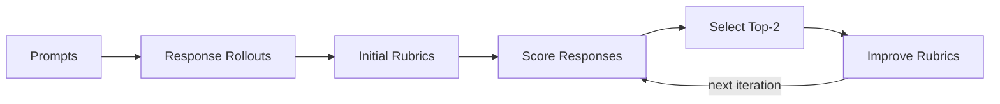

# Chasing the Tail: Effective Rubric-based Reward Modeling for Large Language Model Post-Training

<p align="center">
  <a href="https://arxiv.org/abs/2509.21500"></a>
  <a href="https://huggingface.co/datasets/JunkaiZ/Rubrics"></a>
</p>

<h3 align="center">
  
</h3>


## Overview

This repository implements the **Refinement-through-Differentiation** workflow for generating high-quality, prompt-specific rubrics. The pipeline consists of three core stages:

1. **Response Generation** &mdash; Collect diverse responses from one or multiple LLMs for each prompt.
2. **Rubric Generation** &mdash; Propose an initial set of binary, weighted criteria per prompt.
3. **Iterative Refinement** &mdash; Score responses against the rubric, select the top-performing pair, and refine the rubric to better differentiate them. Repeat for multiple iterations.



## Project Structure

```
rubrics/
├── generator/                  # Core rubric generation modules
│   ├── generate_rubrics.py     #   Initial rubric generation from prompts
│   ├── score_responses.py      #   Score responses against rubrics
│   ├── improve_rubrics.py      #   Refine rubrics using top-scoring response pairs
│   ├── rollouts.py             #   Generate LLM responses for prompts
│   ├── vllm_server.py          #   vLLM server management for local models
│   ├── utils.py                #   API client and shared utilities
│   └── prompts/                #   Prompt templates
│       ├── generate_rubrics.txt
│       ├── improve_rubrics.txt
│       └── verifier_explicit.txt
└── workflow/                   # Hydra-based workflow orchestration
    ├── workflow.py             #   CLI entry point
    ├── workflow_engine.py      #   Engine with config, resume, and output management
    ├── configs/
    │   ├── single.yaml         #   Single-round refinement config
    │   └── iterative.yaml      #   Multi-iteration refinement config
    ├── orchestration/          #   Workflow coordination and iteration logic
    ├── core/                   #   Service interfaces and rubric merging
    ├── infrastructure/         #   File I/O and model adapter layer
    └── data_structures.py      #   WorkflowResult, IterationInfo dataclasses
```

## Setup

### Prerequisites

- Python 3.10+
- A running [LiteLLM](https://github.com/BerriAI/litellm) proxy (or any OpenAI-compatible API endpoint)

### Environment

Create a `.env` file in the project root:

```bash
LITELLM_KEY=<your-litellm-api-key>
LITELLM_BASE_URL=http://localhost:4000   # optional, defaults to http://localhost:4000
```

### Install Dependencies

```bash
conda create -n rubrics python=3.12
conda activate rubrics
pip install hydra-core omegaconf openai tqdm python-dotenv datasets transformers
```

## Usage

### 1. Generate Responses

Collect multiple responses per prompt from a single model:

```bash
python -m generator.rollouts \
    --models gemini/gemini-2.5-pro \
    --num-responses-per-model 16 \
    --input-file data/sample_prompts.json \
    --output-dir data \
    --output-filename gemini_pro_rollouts.json
```

Or collect one response per prompt from many models (16 SOTA models by default):

```bash
python -m generator.rollouts \
    --num-responses-per-model 1 \
    --input-file data/sample_prompts.json \
    --output-dir data \
    --output-filename sotas_rollouts.json
```

### 2. Generate Rubrics

**Single-round** refinement (1 iteration, 2 responses per prompt):

```bash
python -m workflow.workflow \
    --config-name single \
    files.responses_file=data/gemini_pro_rollouts.json
```

**Iterative** refinement (4 iterations, 16 responses per prompt):

```bash
python -m workflow.workflow \
    --config-name iterative \
    files.responses_file=data/gemini_pro_rollouts.json
```

### 3. Configuration

The workflow uses [Hydra](https://hydra.cc/) for configuration. Override any setting from the command line:

```bash
python -m workflow.workflow \
    --config-name iterative \
    files.responses_file=data/gemini_pro_rollouts.json \
    workflow.max_iterations=3 \
    workflow.sample_size=100 \
    models.rubric_generator=openai/gpt-4.1 \
    models.verifier=openai/gpt-4.1-mini
```

Key configuration options (see `workflow/configs/`):

| Parameter | Description | Default |
|---|---|---|
| `workflow.max_iterations` | Number of refinement iterations | 1 (single) / 4 (iterative) |
| `workflow.initial_responses_per_prompt` | Responses per prompt | 2 (single) / 16 (iterative) |
| `workflow.sample_size` | Limit number of prompts | `null` (all) |
| `models.rubric_generator` | Model for rubric generation | `openai/gpt-4.1` |
| `models.verifier` | Model for response scoring | `openai/gpt-4.1-mini` |
| `api.base_url` | API endpoint URL | env `LITELLM_BASE_URL` |
| `api.workers` | Parallel API workers | 64 |

## Dataset

The published rubric datasets are available on HuggingFace: [JunkaiZ/Rubrics](https://huggingface.co/datasets/JunkaiZ/Rubrics)


Each record contains:

| Field | Description |
|---|---|
| `prompt` | The user instruction or question |
| `rubrics` | List of binary criteria, each with a `criterion` (text) and `weight` (1&ndash;3) |
| `number_of_criteria` | Number of criteria per rubric (4&ndash;37) |
| `total_weight` | Sum of all criterion weights |

Load the dataset with:

```python
from datasets import load_dataset

# Health domain
health = load_dataset("JunkaiZ/Rubrics", "health")

# Generalist domain
generalist = load_dataset("JunkaiZ/Rubrics", "generalist")
```

## Citation

```bibtex
@inproceedings{zhang2026chasing,
  title={Chasing the Tail: Effective Rubric-based Reward Modeling for Large Language Model Post-Training},
  author={Zhang, Junkai and Wang, Zihao and Gui, Lin and Mysore Sathyendra, Swarnashree and Jeong, Jaehwan and Veitch, Victor and Wang, Wei and He, Yunzhong and Liu, Bing and Jin, Lifeng},
  booktitle={International Conference on Learning Representations (ICLR)},
  year={2026}
}
```
